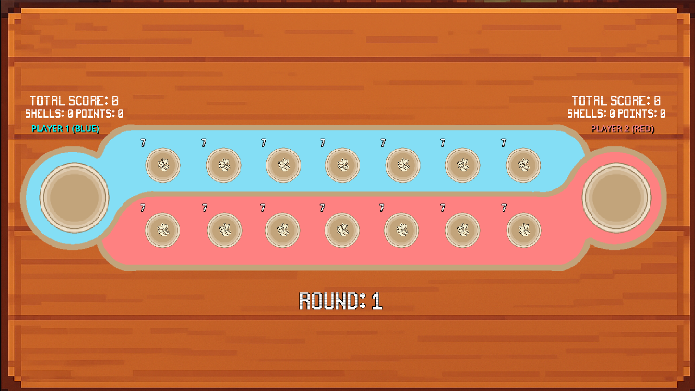

# Tangka

A roguelike strategy game inspired by the traditional Filipino game Sungka where you collect shells and build synergies to outscore opponents.

## 🎮 Gameplay Preview

[**Watch Gameplay Video**](https://drive.google.com/file/d/1bGg8HnLSAWqO2HTV2zhGelj5C8rofp_-/view?usp=sharing)

### Screenshots

*Main menu interface*

*In-game battle showing shell distribution and pit effects*

*Special card selection screen*

*Victory screen showing final scores*

## 🎯 Game Modes

- **Player vs Player**: Local multiplayer battles
- **Campaign Mode**: Single-player progression *(in development)*

## ⚡ Features

### Advanced Mechanics
- **Strategic Shell Movement**: Classic Sungka mechanics with modern twists
- **12 Unique Shell Types**: Each with special abilities and effects
- **Special Pit Types**: 11 different pit effects that modify gameplay
- **Status Effects**: Multiplier stacks, burn, freeze, luck, curse, and more
- **Dynamic Scoring**: Complex point calculations with stack interactions
- **Win Conditions**: First to 100 total points OR traditional Sungka rules
- **Turn-based Strategy**: Plan your moves carefully for maximum impact

### Presentation
- **Scalable UI**: Automatically adjusts to different screen resolutions
- **Visual Effects**: Particle systems for special abilities
- **Audio Feedback**: Unique sounds for each shell type and effect
- **Smooth Animations**: Fluid shell movement and visual polish

## 🎮 Controls

### Mouse Controls
- **Right Click & Hover**: View pit type information
- **Left Click**: Select pit to distribute shells
- **Left Click**: Choose special cards
- **Left Click**: Navigate menus and UI elements

## 💻 System Requirements

### Minimum Requirements
- **OS**: Windows 10, macOS 10.12, or Ubuntu 16.04+
- **Engine**: Godot 4.0+
- **RAM**: 2 GB
- **Storage**: 500 MB available space
- **Graphics**: DirectX 11 compatible
- **Input**: Mouse required for gameplay

### Recommended
- **RAM**: 4 GB or more for optimal performance
- **Graphics**: Dedicated graphics card for better visual effects

## 🛣️ Development Status & Roadmap

### ✅ Completed Features
- Full multiplayer gameplay with all 12 shell types
- Complete status effect system
- Pit type mechanics (11 different types)
- Win condition system
- Audio system with unique shell sounds

### 🔄 In Development
- **Campaign Mode**: Single-player progression with bots
- **Enhanced Visuals**: More particle effects and animations
- **Game Balancing**: Fine-tuning shell abilities and scoring
- **Game Info Book**: Complete guide for all mechanics, shells, and pit types

### 📋 Planned Features
- **Online Multiplayer**: Play against friends remotely
- **Leaderboards**: Track your best scores and win streaks
- **Mobile Version**: iOS and Android compatibility

## 👥 Credits

### Development Team
- **Programmer**: Francis Gabriel Austria
- **Programmer**: Jorge Maverick Acidre
- **Concept Artist & UI Designer**: Om Shanti Limpin
- **Mentor**: Mark Joseph Jagolino Solidarios

## 📞 Contact

**Email**: francisgabriel.austria@wvsu.edu.ph

---

*Built with ❤️ using Godot Engine*
